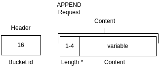
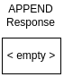
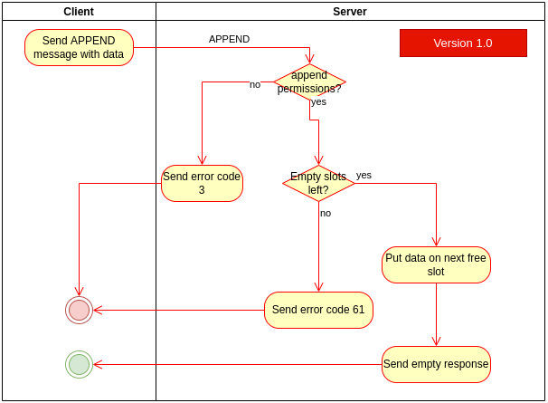

# APPEND
> &larr; Back to [Home](../index.md) - To [Transport](./index.md)

---
The APPEND packet is used to [PUT](./put.md) data to a server without specifying the slot index. It will append the data to the first following empty slot in the bucket.

## Request

_Figure A: APPEND request byte-map (header and body)_

---
The APPEND request (see Figure A) **includes a header**. This header contains one field: the [bucket id](./create.md#bucket-id) and is used to indicate which bucket is used.

The APPEND packet does not accept any extra flags.

The body contains an array with the following fields:
- **Length**: a [dynamically sized](./index.md#dynamically-sized-length) integer that indicates the length of the following content.
- **Content**: variable-length byte content. Can be literally everything, but is limited to ~268 MB due to the [dynamic length](./index.md#dynamically-sized-length) property of the request packet which is currently limited to 4 bytes from which 28 bits can be used.

## Response

_Figure B: APPEND response byte-map_

---
The APPEND response is empty, and the result is indicated by a [status code](./index.md#response-codes).

You might encounter the following [error codes](./error.md#error-codes):
- 3 (invalid permissions): you try to put data on a non-empty slot without _write_ permissions or you have no _write_ or _append_ permissions at all. This can also mean you are missing the bucket key.
- 4 (authentication failed): the bucket key you are providing might not be valid
- 5 (payload too large): you try to put more data to a slot than the server supports. Try splitting your data on multiple slots
- 21 (bucket does not exist): The bucket you are trying to PUT to does not exist
- 61 (bucket full): The bucket you are trying to append data to is full (reached slot 65,535)

## Process and flow

_Figure C: APPEND process flow_

---
The APPEND process (see _Figure C_) goes as follows:

1. User sends APPEND request to server
2. If the bucket has no append permissions, send error code 3
3. If there are no empty slots left, send error code 61
4. If not, put the data on the next free slot
5. Return empty response

---
> &larr; Back to [Home](../index.md) - To [Transport](./index.md) - Prev: [PUT packet](./put.md) - Next: [WIPE packet](./wipe.md) &rarr;