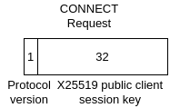
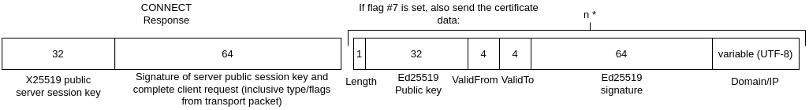
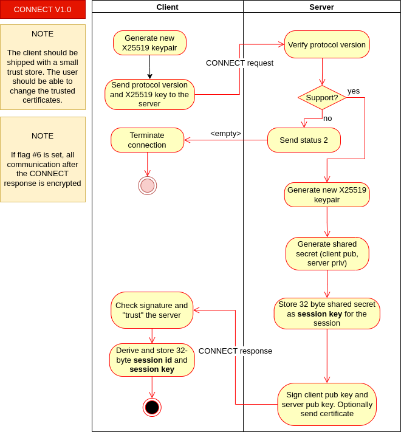

# CONNECT
> &larr; Back to [Home](../index.md) - To [Transport](./index.md)

---

The CONNECT packet is sent immediately after a client connected to a server. The connect handshake is used to exchange **session keys** and to verify the identify of the server (the client stays anonymous). Optionally, you can upgrade to an encrypted connection using the CONNECT. A CONNECT packet **is not encrypted**, unless you are using Plabble over TLS. The CONNECT packet has **no** request header fields and **no** response header fields.

## Request

_Figure A: Connect request byte-map (body)_

---
When you want to initiate a session you need no send a CONNECT request packet (see _Figure A_) to a server. The request packet contains the following data:
- **Protocol version** (1 byte, uint-8): The version of the **transport protocol** that is used.
- **Public key** (32 bytes): Random `X25519` key generated for this session.

The connect packet has two [flags](./index.md#request-flags):
- #6: _upgrade to encrypted connection_. If this flag is set, the server will turn on encryption. However, the CONNECT response is still not encrypted (because the keys are not exchanged yet). When using an underlying protocol that already ensures transport encryption like TLS, this flag is mostly of the time not used.
- #7: _send certificate in response_. If this flag is set, the server will send its certificate. See [response](#response).

## Response

_Figure B: Connect response bytemap_

---
The response that is sent back by the server (see _Figure B_) contains the following data:
- **Public key** (32 bytes): The random `X25519` public key generated by the server
- **Signature** (64 bytes): Signature from the server signed with the **server key** which is stored in the server certificate. The signature is created with the following data: The entire client [request](#request) (including the codec data without length, 34 bytes) + the random server public key (32 bytes)
- Optionally the **certificate chain**, containing the server certificate and the other certificates in the chain in order [0: Server][1..n-1: CA][n: Root CA]. This part is only sent if the client set flag #7 in the request.

The certificate contains the following fields:
- **Length** (1 byte, uint-8) the length of the following certificate in bytes. This includes all the fields
- **Public key** (32 bytes) The `Ed25519` signing key associated of the server which is the **identity key** of the server
- **ValidFrom** (4 bytes): A [Plabble Timestamp](./index.md#plabble-timestamp) that contains the moment from which the certificate is valid
- **ValidTo** (4 bytes): A [Plabble Timestamp](./index.md#plabble-timestamp) that contains the expiration date until the certificate is valid
- **Signature** (64 bytes): The signature of the other fields in the certificate, signed with the key of the authority. The root certificate is self-signed, but a Plabble client does not accept other self-signed certificates by default
- **Domain/IP** (variable): **UTF-8** encoded domain or IP address of the server the public key is associated with. Technical maximum of **151** bytes.

You might encounter the following [error codes](./error.md#error-codes):
- 2 (unsupported protocol version): if protocol version is not supported by the server
- 31 (no certificate available): if flag #7 set and for some reason the server is unable to provide a valid certificate. Terminate connection if this happens.
- 32 (could not upgrade to encrypted connection): failed or refused to upgrade to encrypted connection

## Process and data flow

_Figure C: Connect process flow_

---
The CONNECT process (see _Figure C_) works as follows:
1. The client generates a new, random `X25519` keypair and stores this for the session.
2. The client sends the protocol version and the public key to the server in a CONNECT [request](#request) packet. If the client wants to upgrade to an encrypted connection or to receive the signature, it sets the flags in the packet
3. The server verifies the protocol version. If the protocol version is not supported, the server sends [error code](./error.md#error-codes) #2 _Unsupported protocol version_. 
4. The server also generates a new, random `X25519` keypair.
5. The server generates a _shared secret_ from its private X25519 key and the public X25519 key received from the client
6. The server stores the 32-byte shared secret for the session as **session key**.
7. The server signs the entire client request + the X25519 public key from step 4 with the **identity key** (the private key associated with the certificate of the server).
8. The server sends the X25519 key, the signature and optionally the certificate chain in a CONNECT [response](#response) packet to the client.
9. The client checks the certificate, if it was requested and provided. If requested but not provided or not valid, it aborts the connection
10. The clients checks the signature the server had sent. It aborts the connection if the signature is not valid
11. The client generates a shared secret from own public X25519 key and the X25519 key received from the server
12. The client performs step 6 and stores the result
13. The server and client are now connected

---
> &larr; Back to [Home](../index.md) - To [Transport](./index.md) - Next: [CREATE packet](./create.md) &rarr;