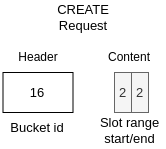
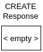
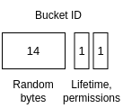
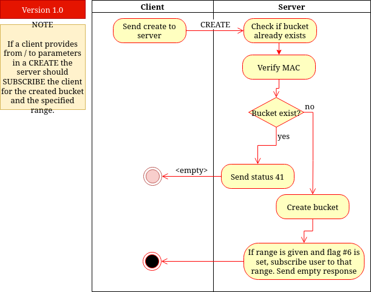

# CREATE
> &larr; Back to [Home](../index.md) - To [Transport](./index.md)

---
The CREATE packet is sent when a user wants to create a new [bucket](./index.md#bucket-storage) on a server. The server reacts by creating a bucket which contains 65,536 empty indexes, called **slots**. When creating a bucket, the creator can set bucket permissions (read, append, write) for both "private" and "public" mode. A permission in _public_ mode only requires the [bucket id](#bucket-id-and-key) to perform an action. When set to _private_ mode the server also requires the [bucket key](#bucket-id-and-key). Besides creating, it is also possible to subscribe directly to updates on the whole bucket or to a specific range of slots.

## Request



_Figure A: Create request byte-map (header and body)_

---
The CREATE request (see Figure A) **includes a header**. This header contains one field: the **bucket id**. In this bucket id are also the permissions stored and the lifetime of the bucket in days. See [Bucket id](#bucket-id) for more info. The body contains two _optional_ fields:
- **Slot range start** (2 bytes, optional): the (zero-based) index of the slot (uint-16) in the bucket to start subscribing to. For instance, you want to subscribe to slot 10 and up you provide "9" and leave _slot range end_ empty.
- **Slot range end** (2 bytes, optional): the (zero-based) index of the slot (uint-16) in the bucket to subscribe until. For instance, you want to subscribe from slot 5 until 10, you provide "4" to _slot range start_ and "9" to this field.

It is possible to only provide the start slot (subscribe to slot _n_ and up), both slots (subscribe to range of slots) or none by leaving both fields out (subscribe to full bucket).

The CREATE packet request has two [flags](./index.md#request-flags):
- #6: Also subscribe to the bucket (with optional provided range)
- #7: Don't persist bucket, but only store bucket in RAM

This first flag must be set if you want to subscribe to the bucket. If you provide a range but don't set this subscribe flag, the server will not subscribe you. 

The second flag could be set if you don't want the server to store your bucket on the disk for faster access. This is only smart if you want to stream data via the protocol, else using RAM buckets is not recommended because the data won't persist and your bucket will be lost after a server restart.

## Response



_Figure B: Create response byte-map_

---
To keep it easy for you, the create response is empty, and the result is indicated by a [status code](./index.md#response-codes).

You can expect the following status codes:
- 0 (success): bucket created
- 4 (authentication failed): if no [authentication](./index.md#authentication) data provided
- 10 (subscription success): bucket created and subscribed
- 41 (bucket already exists): if ID is already in use

## Bucket id and key
---
The **bucket id** is used to indicate a bucket on the server and in the CREATE request to set some settings on the bucket (permissions and lifetime). The **bucket key** is used to perform _private_ or secured operations on the bucket (which is determined by the permissions).

### Bucket id



_Figure C: Bucket-id byte-map_

The bucket id is a 16-byte random identifier that is used to locate a bucket on the server and manage permissions (see _Figure C_). The bucket id is created the following way:
1. Create 16 random bytes.
2. Set the bucket lifetime (uint-8) in days (0 for infinite) on the 15th byte.
3. Set the following permission flags on the last 6 bits on the 16th byte (NOT zero indexed):

Bit | Permission
--- | ---
3th | Allow _public_ **read**
4th | Allow _public_ **write** (update message at index)
5th | Allow _public_ **append** (add message to bucket)
6th | Allow _private_ **read**
7th | Allow _private_ **write**
8th | Allow _private_ **append**

Most commonly, the 6th is always set. Don't be so stupid to forget, because some server implementations might be very strict and also disallow reading although you own the bucket key if this flag is not set.

### Bucket key
The 32-byte bucket key is not sent over the network, to increase safety and make the protocol more lightweight. However, both the client and the server have to know the key for authentication. So we generate a _shared secret_ using `HKDF-SHA256`, the **session id** (from the CONNECT process), the **bucket id** and the **client counter** (as uint-16 2 bytes) + the hardcoded byte `0x01`.

```
Bucket key = HKDF(key: session id, info: concat(bucket id, client counter, 0x01), salt: nil)
```
The bucket key is stored and used for [authentication](./index.md#authentication).

## Process and flow



_Figure D: Create process flow_

---
The CREATE process (see _Figure D_) works as follows:

1. The user generates the [bucket id](#bucket-id) and sets the lifetime and the permission flags
2. The client sends the CREATE packet to the server
3. The server checks and verifies if the ID is not taken and the authentication is correct. If so, the server creates the bucket
4. If the bucket id is already taken the server sends [error code](./index.md#response-codes) #41. 
5. The server subscribes the user to the bucket if flag #6 is set and optionally to a specific range
6. The server sends the empty CREATE response with status code 0 or 10.


---
> &larr; Back to [Home](../index.md) - To [Transport](./index.md) - Prev: [CONNECT packet](./connect.md) - Next: [PUT packet]() &rarr;