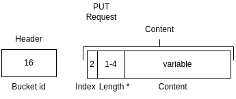
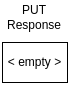
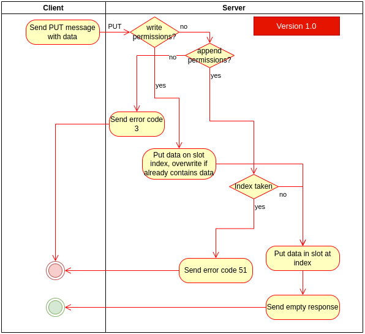

# PUT
> &larr; Back to [Home](../index.md) - To [Transport](./index.md)

---
The PUT packet is used to append data to a bucket or modify existing data in a bucket.

## Request

_Figure A: PUT request byte-map (header and body)_

---
The PUT request (see Figure A) **includes a header**. This header contains one field: the [bucket id](./create.md#bucket-id) and is used to indicate which bucket is used.

The PUT packet accepts one [flag](./index.md#request-flags):
- #6: Include slot index

The body can contain the following fields:
- **Slot index** (optional): a 2-byte integer (uint-16) that indicates the index of the slot in the bucket that must be replaced. Leave out to append to next empty slot.
- **Content**: variable-length byte content. Can be literally everything, but is limited to ~268 MB due to the [dynamic length](./index.md#dynamically-sized-length) property of the request packet which is currently limited to 4 bytes from which 28 bits can be used.

The slot index is set when you want to put the data in a specific slot. This will replace the data in the slot if it is already in use and you have _write_ permissions. If you have _append_ permissions and you try to write data to a slot that is not empty or is not the next empty slot in the bucket the server will send [error code](./index.md#response-codes) 3.

## Response

_Figure B: PUT response byte-map_

---
The PUT response is empty, and the result is indicated by a [status code](./index.md#response-codes).

You can expect the following status codes:
- 0 (success): data saved to bucket
- 3 (invalid permissions): you try to put data on a non-empty slot without _write_ permissions or you have no _write_ or _append_ permissions at all. This can also mean you are missing the bucket key.
- 4 (authentication failed): the bucket key you are providing might not be valid
- 5 (payload too large): you try to put more data to a slot than the server supports. Try splitting your data on multiple slots
- 21 (bucket does not exist): The bucket you are trying to PUT to does not exist
- 51 (bucket full): The bucket you are trying to append data to is full (reached slot 65,535)

## Process and flow

_Figure C: PUT process flow_

---
The PUT process (see _Figure C_) goes as follows:

1. The client sends a PUT message containing the data and optionally containing a slot index
2. The server checks if the user has permission to modify the bucket. If not, error code 3 is sent
3. If the user has write permissions and specified an index, put data to that slot (overwrite if slot is already in use)
4. If the user has append permissions and specified an index, only put data to that slot if slot is not already filled and is the first following empty slot in the bucket. Otherwise, return error 3
5. If the user did not specify an index, add the data to the first following empty slot in the bucket. If no empty slots are left, send error 51

---
> &larr; Back to [Home](../index.md) - To [Transport](./index.md) - Prev: [CREATE packet](./create.md) - Next: [DELETE packet]() &rarr;