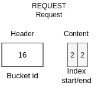
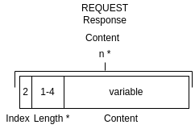
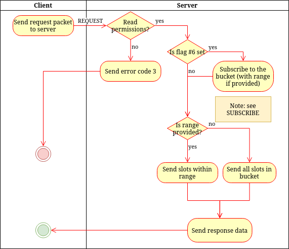

# REQUEST
> &larr; Back to [Home](../index.md) - To [Transport](./index.md)

---
The REQUEST packet is used to get one or more values in a range from a bucket and to subscribe to bucket updates (in the selected range).

## Request

_Figure A: REQUEST request byte-map (header and body)_

---
The REQUEST request (see Figure A) **includes a header**. This header contains one field: the [bucket id](./create.md#bucket-id) which indicates the bucket to request values from.

The REQUEST packet accepts one [flag](./index.md#request-flags):
- #6: Also subscribe to this bucket or the selected range in this bucket

The body can contain the following fields:
- **Slot index start** (optional): a 2-byte integer (uint-16) that indicates the 'from' index of the slot in the bucket that is requested.
- **Slot index end** (optional): a 2-byte integer (uint-16) that indicates the 'to' index of the slot in the bucket that will requested. If omitted, all values from the _start index_ are requested.

If both indexes are omitted, the entire bucket will be requested.

## Response

_Figure B: REQUEST response byte-map_

---
The response packet contains an array of _n_ times the following data (where n equals the amount of requested slots) alongside a status code:
- **Index**: a 2-byte integer (uint-16) that indicates the slot in the bucket at which the following data is stored (because data can be sent out-of-order by the server, or at an unknown point in time when it is a subscribe)
- **Length**: a [dynamically sized](./index.md#dynamically-sized-length) integer that indicates the length of the following data.
- **Content**: The binary content that is in the bucket slot, can be at least 0 bytes and at most the max slot size a server supports.

You might encounter the following [error codes](./error.md#error-codes):
- 3 (invalid permissions): This bucket does not have the correct permissions to be read
- 4 (authentication failed): Authentication for this bucket failed (bucket key missing or invalid)
- 21 (bucket does not exist): The requested bucket is not found

## Process and flow

_Figure C: REQUEST process flow_

---
The REQUEST process (see _Figure C_) goes as follows:

1. The client sends a REQUEST packet to the server
2. If the bucket exists but the user does not have write permission, return error code 3.
3. If the subscribe flag is set, subscribe user to bucket (optionally with range), see [SUBSCRIBE]().
4. If the flag is not set but a range is provided, select the slots from the database within the range.
5. If the range is not provided, get all slots from the database
6. Create the response and send it to the user.

Note: If the user has subscribed and an update is pushed to the bucket, the server will send another response to the REQUEST request if this request asked to subscribe. This packet looks the same as a REQUEST response.

---
> &larr; Back to [Home](../index.md) - To [Transport](./index.md) - Prev: [WIPE packet](./wipe.md) - Next: [SUBSCRIBE packet](./subscribe.md) &rarr;