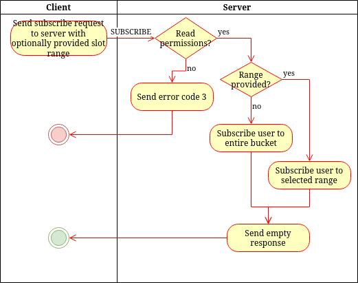

# SUBSCRIBE
> &larr; Back to [Home](../index.md) - To [Transport](./index.md)

---
The SUBSCRIBE packet is used to subscribe the user to updates from a bucket or from a range of slots in a bucket. It returns the data asynchronous and potentially partial, so after the SUBSCRIBE response other responses can be expected in the future. These are [REQUEST](./request.md#response) responses.

## Request

_Figure A: SUBSCRIBE request byte-map (header and body)_

---
The SUBSCRIBE request (see Figure A) **includes a header**. This header contains one field: the [bucket id](./create.md#bucket-id) which indicates the bucket to subscribe to.

The SUBSCRIBE packet accepts no extra flags.

The body can contain the following fields:
- **Slot index start** (optional): a 2-byte integer (uint-16) that indicates the 'from' index of the slot in the bucket to subscribe to
- **Slot index end** (optional): a 2-byte integer (uint-16) that indicates the 'to' index of the slot in the bucket to subscribe to. If omitted, the user will be subscribed from the _slot index start_ until the end of the bucket

If both indexes are omitted, the user will be subscribed to all slots/to the entire bucket.

## Response

_Figure B: SUBSCRIBE response byte-map_

---
The SUBSCRIBE request does not return any data directly. However, when an update occurs, a [REQUEST](./request.md#response) response is sent to the user.

You might encounter the following [error codes](./error.md#error-codes):
- 3 (invalid permissions): This bucket does not have the correct permissions to be read (so we can't subscribe either)
- 4 (authentication failed): Authentication for this bucket failed (bucket key missing or invalid).
- 21 (bucket does not exist): The requested bucket is not found

## Process and flow

_Figure C: SUBSCRIBE process flow_

---
The SUBSCRIBE process (see _Figure C_) goes as follows:

1. The client sends a SUBSCRIBE packet to the server
2. The server checks if the user has read permissions. If not, error code 3 is sent.
3. If a range is provided, the user is subscribed to only that slot range
4. If no range is provided, the user is subscribed to the entire bucket (all slots)
5. When an update is pushed to the bucket (a slot is added or modified, or wiped) a [REQUEST](./request.md#response) is sent with the update data. This response is sent after the response of step 5.

---
> &larr; Back to [Home](../index.md) - To [Transport](./index.md) - Prev: [REQUEST packet](./request.md) - Next: [UNSUBSCRIBE packet](./unsubscribe.md) &rarr;