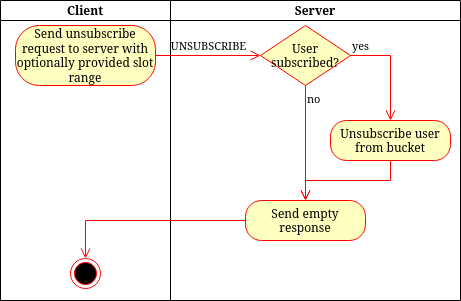

# UNSUBSCRIBE
> &larr; Back to [Home](../index.md) - To [Transport](./index.md)

---
The UNSUBSCRIBE packet is used to tell the server that you are no longer interested in updates of a specific bucket

## Request

_Figure A: UNSUBSCRIBE request byte-map (header and body)_

---
The UNSUBSCRIBE request (see Figure A) **includes a header**. This header contains one field: the [bucket id](./create.md#bucket-id) which indicates the bucket unsubscribe from.

The SUBSCRIBE packet has no body and does not accept any extra flags.

## Response

_Figure B: UNSUBSCRIBE response byte-map_

---
The UNSUBSCRIBE request does not return any data.

You may expect the following [status codes](./index.md#response-codes):
- 0 (success): Unsubscribed successfully
- 4 (authentication failed): Authentication for this bucket failed (bucket key missing or invalid)
- 21 (bucket does not exist): The requested bucket is not found

## Process and flow

_Figure C: UNSUBSCRIBE process flow_

---
The UNSUBSCRIBE process (see _Figure C_) goes as follows:

1. The client sends a UNSUBSCRIBE packet to the server
2. The server checks if the user is subscribed. If so, it removes the subscription.
3. The server sends status code 0.

---
> &larr; Back to [Home](../index.md) - To [Transport](./index.md) - Prev: [SUBSCRIBE packet](./subscribe.md) &rarr;