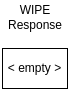

# WIPE
> &larr; Back to [Home](../index.md) - To [Transport](./index.md)

---
The WIPE packet is used to remove/clear one or multiple values from the bucket, or to delete the entire bucket.

## Request

_Figure A: WIPE request byte-map (header and body)_

---
The WIPE request (see Figure A) **includes a header**. This header contains one field: the [bucket id](./create.md#bucket-id) and is used to indicate which bucket must be wiped.

The WIPE packet accepts one [flag](./index.md#request-flags):
- #6: Delete entire bucket

The body can contain the following fields:
- **Slot index start** (optional): a 2-byte integer (uint-16) that indicates the 'from' index of the slot in the bucket that will be cleared. If the _slot index end_ is omitted, this will wipe all slots in the bucket until the end.
- **Slot index end** (optional): a 2-byte integer (uint-16) that indicates the 'to' index of the slot in the bucket that will be cleared. All values between the start and end index (including themselves) will be wiped.

If both indexes are omitted, the entire bucket will be wiped.

## Response

_Figure B: WIPE response byte-map_

---
The WIPE response is empty, and the result is indicated by a [status code](./index.md#response-codes).

You might encounter the following [error codes](./error.md#error-codes):
- 3 (invalid permissions): you are not allowed to wipe this bucket (no write permissions)
- 4 (authentication failed): the bucket key you are providing might not be valid
- 21 (bucket does not exist): requested bucket not found
- 71 (delete not allowed): bucket is not allowed to be deleted

## Process and flow

_Figure C: WIPE process flow_

---
The WIPE process (see _Figure C_) goes as follows:

1. The client sends a WIPE packet containing the bucket id of the bucket to be wiped and optionally a start and/or end index
2. The server checks if the user has the permissions to write to the bucket. If not, error code 3 is send.
3. If the 6th flag is set (delete entire bucket) and the bucket has permission 6 (allow delete), the entire bucket is deleted. If not, error 71 is send.
4. If flag #6 is not set, and the indexes are provided, the slots between the indexes are cleared.
5. If only the start index is provided, all slots from the start index until the end of the bucket are cleared
6. If no indexes are provided, all slots are cleared

---
> &larr; Back to [Home](../index.md) - To [Transport](./index.md) - Prev: [PUT packet](./put.md) - Next: [REQUEST packet](./request.md) &rarr;